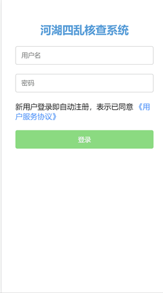
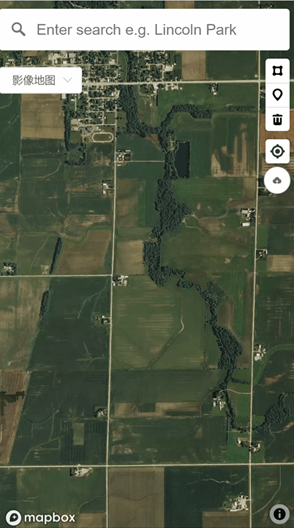

# 河湖四乱核查系统

> A Vue.js project 

## Build Setup

``` bash
# install dependencies
npm install

# serve with hot reload at localhost:8080
npm run dev

# build for production with minification
npm run build

# build for production and view the bundle analyzer report
npm run build --report
```

For a detailed explanation on how things work, check out the [guide](http://vuejs-templates.github.io/webpack/) and [docs for vue-loader](http://vuejs.github.io/vue-loader).


用户登录系统后发现有乱建、乱占等行为，可以在地图上圈住该地方上传到数据库

应用在移动端，所以样式采用移动端的样式






后台：python flask框架

数据库：MongoDB

运行： python app.py

